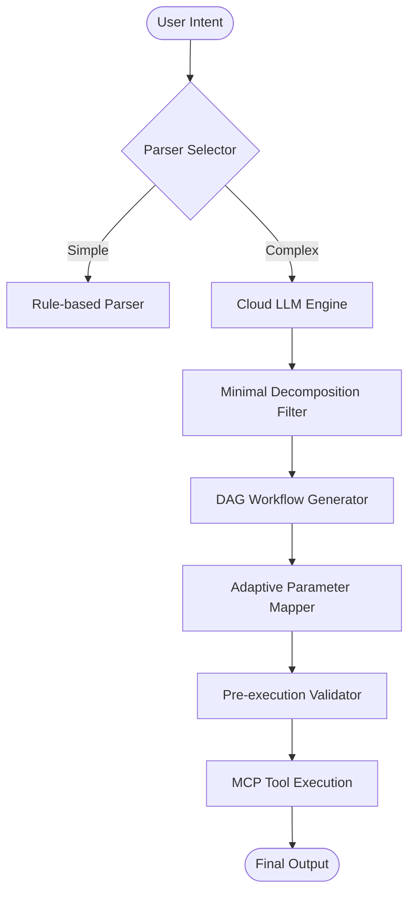

# IntentOrch

[](https://www.npmjs.com/package/@mcpilotx/intentorch)
[](LICENSE)
[](https://www.typescriptlang.org/)


[English] | [简体中文](./README.zh-CN.md)

**IntentOrch** is a high-performance, intent-driven orchestration engine designed for the **Model Context Protocol (MCP)** ecosystem. It transforms vague natural language instructions into precise, executable, and resilient tool-calling workflows.

---

## 🚀 Why IntentOrch?

Current LLM tool-calling often suffers from "Over-decomposition" (wasting tokens on redundant steps) or "Schema Mismatch" (naming conflicts between different MCP servers). IntentOrch solves these with a professional-grade orchestration layer.

### 💎 Core Pillars

- **Minimal Decomposition Principle**: Intelligent pre-analysis to ensure the simplest possible execution path. Avoids redundant steps and significantly reduces LLM latency and cost.
- **Adaptive Parameter Mapping**: A semantic-aware mapping engine that bridges the gap between LLM reasoning and heterogeneous MCP Tool Schemas (e.g., automatically mapping `filename` to `path`).
- **Resilient DAG Engine**: Executes tasks using Directed Acyclic Graphs (DAG) with built-in dependency tracking, topological sorting, and sophisticated error recovery.
- **Hybrid Intent Parsing**: Combines ultra-fast rule-based heuristics with deep LLM reasoning to achieve the optimal balance between performance and accuracy.

---

## 📦 Installation

```bash
npm install @mcpilotx/intentorch
```

---

## ⚡ Quick Start

Experience the magic of multi-tool orchestration in just a few lines of code.

```typescript
import { createSDK } from '@mcpilotx/intentorch';

const sdk = createSDK();

// 1. Configure your AI brain
await sdk.configureAI({
  provider: 'openai', // or 'deepseek', 'ollama', etc.
  apiKey: process.env.OPENAI_API_KEY,
  model: 'gpt-4o'
});

// 2. Connect multiple MCP Servers
await sdk.connectMCPServer({
  name: 'github',
  transport: { type: 'stdio', command: 'npx', args: ['-y', '@modelcontextprotocol/server-github'] }
});

await sdk.connectMCPServer({
  name: 'slack',
  transport: { type: 'stdio', command: 'npx', args: ['-y', '@modelcontextprotocol/server-slack'] }
});

// 3. Orchestrate complex intent
const result = await sdk.executeWorkflowWithTracking(
  "Analyze the latest PR in mcpilotx/intentorch and send a summary report to Slack #dev-channel"
);

console.log('Workflow Finished:', result.success);
```

---

## 🛠 Architecture

IntentOrch operates as an intelligent middleware between your Application and the MCP ecosystem:



---

## 🌟 Advanced Features

### 🧩 Interactive Confirmation
When intent confidence is low, IntentOrch can automatically pause and request user confirmation before executing critical tools.

### 📝 @intentorch Directives
Intervene in the orchestration process using natural language directives:
- `Analyze the logs @intentorch summary` -> Automatically appends an AI-generated summary step to the workflow.

### 🛡️ Resilience & Safety
Built-in `RetryManager`, `FallbackManager`, and `PerformanceMonitor` ensure your workflows are production-ready.

---

## 📄 License

Apache-2.0 License. See [LICENSE](LICENSE) for details.

---

## 🤝 Contributing

We welcome contributions! Please feel free to submit a Pull Request.

---

Built with ❤️ by **MCPilotX**
